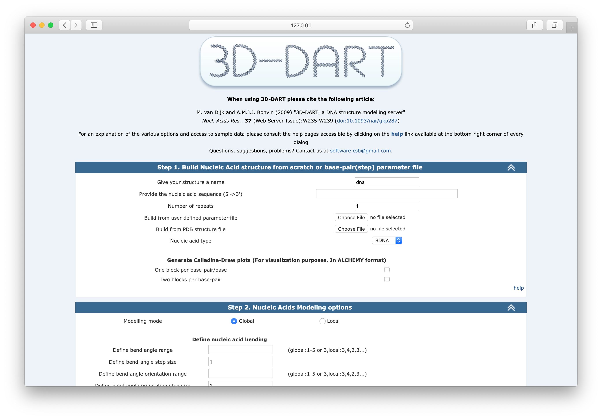
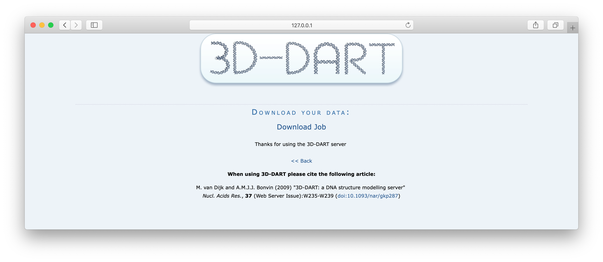

# 3D-DART-server

3D-DART web server repository. Docker is needed in order to build the 3D-DART server container and to execute it. It is based in the Ubuntu 18.04 Docker image (with 32bit support needed for the version of X3DNA software used by 3D-DART) and with Apache2 and Python 2.7.

**Please note that 3D-DART server is legacy software and many input data errors are not properly checked/validated.**

## 1. Setup

### 1.1. Build Docker container

**Note:** if using git on Windows, please make sure **automatic conversion of EOL is set to `false`** to avoid mixing `\r` and `\n` end of lines: `git config --global core.autocrlf false`.

```bash
cd 3D-DART-server
docker build -t 3d-dart .
```

### 1.2. Run 3D-DART Docker container

```bash
docker run --name 3ddart -p 80:80 -i -t 3d-dart
```

### 1.3. Stop 3D-DART Docker container

From the terminal, Ctrl+C.

In case of re-running the container, previous exited containers must be cleaned:

```bash
docker rm $(docker ps --filter "status=exited" -q)
```

And then again:

```bash
docker run --name 3ddart -p 80:80 -i -t 3d-dart
```

## 2. How to use the server

### 2.1. Web interface

Once the docker container is running, 3D-DART server will be available from the url [http://127.0.0.1](http://127.0.0.1):



This is the default interface, `DARTCustombuild`. There are several examples of this form pre-filled in the following urls:

* [http://127.0.0.1/3DDART/html/Example1.html](http://127.0.0.1/3DDART/html/Example1.html)
* [http://127.0.0.1/3DDART/html/Example2.html](http://127.0.0.1/3DDART/html/Example2.html)
* [http://127.0.0.1/3DDART/html/Example3.html](http://127.0.0.1/3DDART/html/Example3.html)
* [http://127.0.0.1/3DDART/html/Example4.html](http://127.0.0.1/3DDART/html/Example4.html)

For example, this is Example1.html:


Once input data is filled and `Submit` button clicked, you will be redirected to the results page:



Server results are also available through this link: [http://127.0.0.1/3DDART/server/results/](http://127.0.0.1/3DDART/server/results/).

In case of server logic error, temporary error pages are generated at: [http://127.0.0.1/3DDART/error/](http://127.0.0.1/3DDART/error/).

### 2.2. Command line

First, get a bash terminal from the Docker container:

```bash
docker exec -it 3ddart bash
```

You will find the server logic in `/var/www/html/3DDART` path. `RunDART.py` might be called from any location:

```bash
root@ccfe5d663254:/# cd /var/www/html/3DDART
root@ccfe5d663254:/var/www/html/3DDART# ls
cgi  error  html  index.html  server  software
root@ccfe5d663254:/var/www/html/3DDART# RunDART.py 
--> Performing System Checks:
   * Python version is: 2.7.1
   * Could not import Numeric package try numpy
   * Importing numpy package succesfull
--> Your current working directory is: /var/www/html/3DDART
--------------------------------------------------------------------------------------------------------------
Welcome to 3D-DART version 1.2   Fri Aug 28 09:26:19 2020
--------------------------------------------------------------------------------------------------------------
```

For more information about how to use `RunDART.py` please refer to the standalone version of [3D-DART](https://github.com/haddocking/3D-DART).
